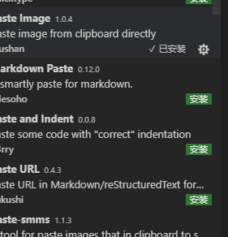

<!-- markdown语法文档 -->
## 这是
## 这是

paste 插件可用于md文件中插图，快速张贴剪切板的图片，ctrl alt v

project插件项目管理，便于多个项目的查看
ctrl shift p   save project就加到项目管理区了
live server插件，服务器打开，右键，移动端开发真鸡调试
vscode icons插件文件的标志性图标
document this 函数参数说明等 ctrl alt d两次即可
/**
 *
 *
 * @param {*} x
 * @param {*} x1
 */
function a(x,x1){

}
log.json文件夹里设置
设置代码段，就是设置关键字出现代码。文件  首选项 大码段设置 输入代表的词或标记代码 回车 修改最下面注释掉的 eg:输入log 第二个及出现console.log()

gitignore  项目下需要忽略的文件，在git中。创建".gitignore "文件，将文件名写进去
安装插件后，选择文件夹右键即可